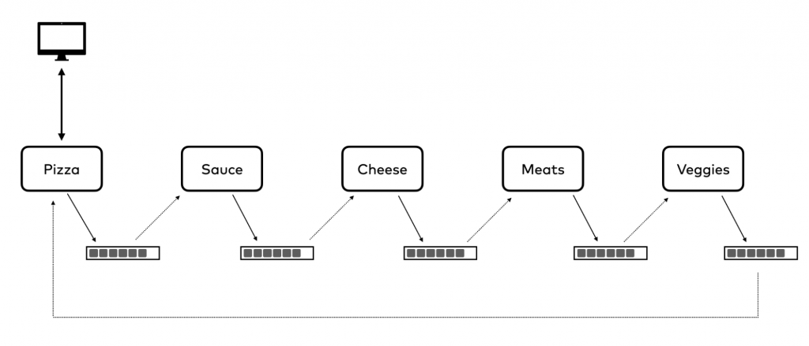

## About
My attempt to understand event driven system using ConfluentKafka and FastAPI

This is simple data flow illustation of pizza generaion service.


## Setup

Run everything with bash script
```
chmod +x services.sh && ./services.sh
```
Go to swagger and make couple of orders ;)


## Swagger
http://0.0.0.0:8000/docs
